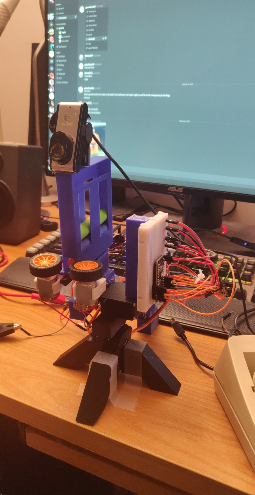
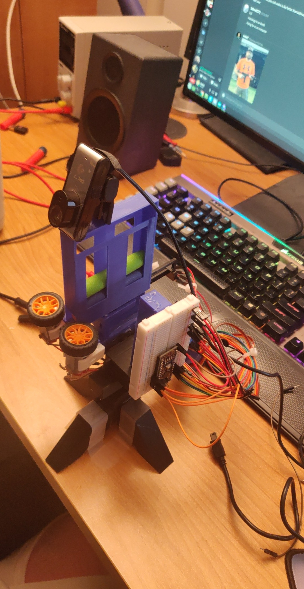

# Nerf Autoturret
Utilizes OpenCV (Go wrapper) to detect faces from a webcam, then sends commands over USB to control movement from an Arduino Nano.

<a href="https://www.youtube.com/watch?v=S9ck80dR73s"/>Here's a small video of me shooting myself with it.</a>  

